# Practica 1

- [Ejercicio 1](#ejercicio-1)
- [Ejercicio 2](#ejercicio-2)
- [Ejercicio 3](#ejercicio-3)
- [Ejercicio 4](#ejercicio-4)
- [Ejercicio 5](#ejercicio-5)
- [Ejercicio 6](#ejercicio-6)
- [Ejercicio 7](#ejercicio-7)
- [Ejercicio 8](#ejercicio-8)
- [Ejercicio 9](#ejercicio-9)
- [Ejercicio 10](#ejercicio-10)
- [Ejercicio 11](#ejercicio-11)
- [Ejercicio 12](#ejercicio-12)
- [Ejercicio 13](#ejercicio-13)
- [Ejercicio 14](#ejercicio-14)
- [Ejercicio 15](#ejercicio-15)
- [Ejercicio 16](#ejercicio-16)
- [Ejercicio 17](#ejercicio-17)
- [Ejercicio 18](#ejercicio-18)
- [Ejercicio 19](#ejercicio-19)

### Ejercicio 1

Para probar esta ley distributiva, podemos usar las propiedades de las operaciones lógicas y las tablas de verdad.

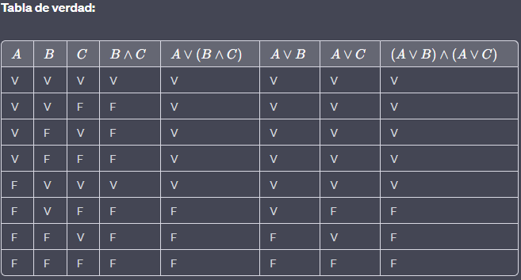
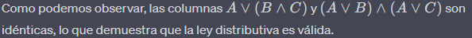

---

### Ejercicio 2

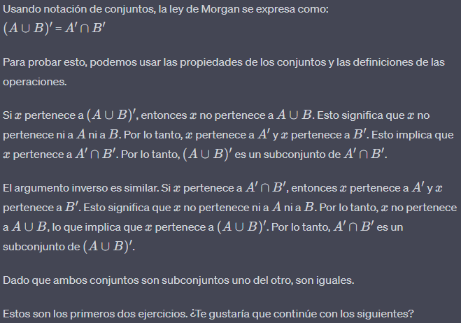

---

### Ejercicio 3

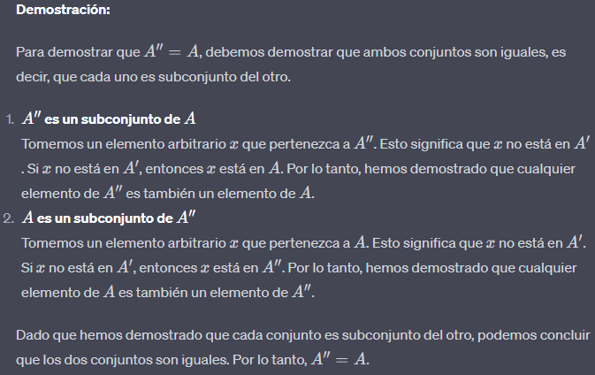

---

### Ejercicio 4

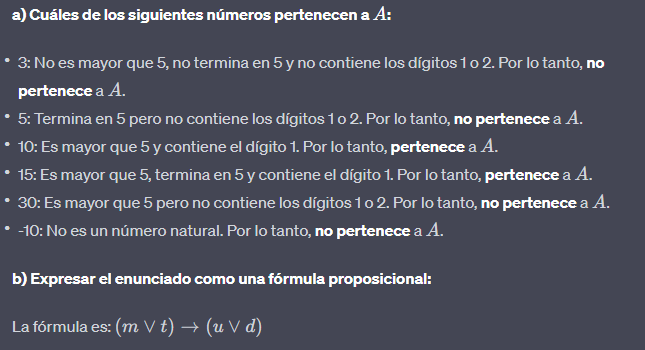
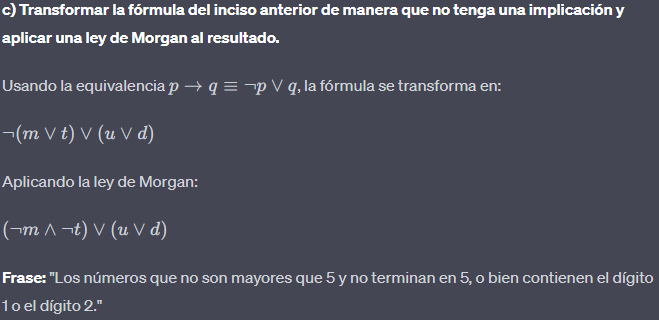

---

### Ejercicio 5

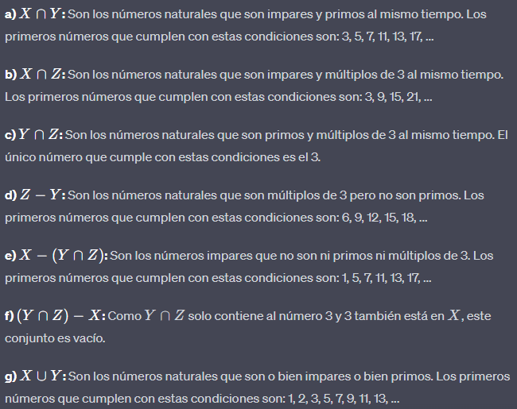

Es importante notar que estos conjuntos son infinitos, por lo que solo se han listado algunos de sus primeros elementos para dar una idea de su composición.

---

### Ejercicio 6

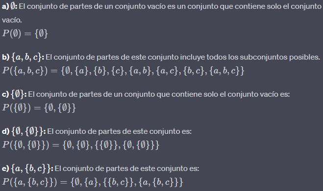

Estos son los conjuntos de partes para cada uno de los conjuntos dados en el ejercicio 6.

---

### Ejercicio 7

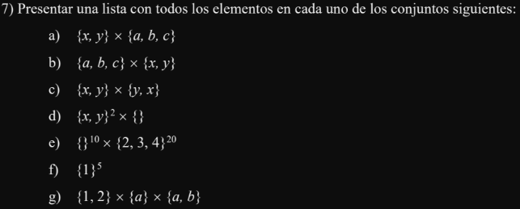

---
### Ejercicio 8

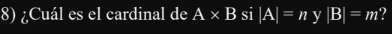

---
### Ejercicio 9

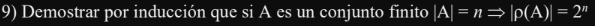

---
### Ejercicio 10

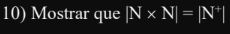

---
### Ejercicio 11

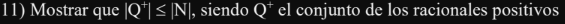

---
### Ejercicio 12

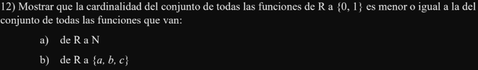

---
### Ejercicio 13

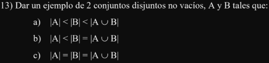

---
### Ejercicio 14

---
### Ejercicio 15

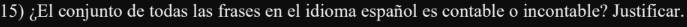

---
### Ejercicio 16

---
### Ejercicio 17

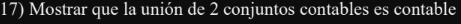

---
### Ejercicio 18

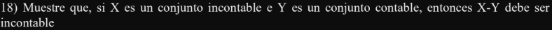

---

### Ejercicio 19

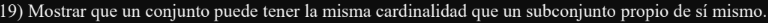

---