# Practica 1

### Ejercicio 1

Para probar esta ley distributiva, podemos usar las propiedades de las operaciones lógicas y las tablas de verdad.

---

### Ejercicio 2

---

### Ejercicio 3

---

### Ejercicio 4

---

### Ejercicio 5

Es importante notar que estos conjuntos son infinitos, por lo que solo se han listado algunos de sus primeros elementos para dar una idea de su composición.

---

### Ejercicio 6

Estos son los conjuntos de partes para cada uno de los conjuntos dados en el ejercicio 6.

---

### Ejercicio 7

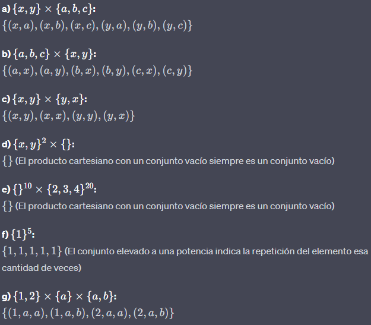

---
### Ejercicio 8

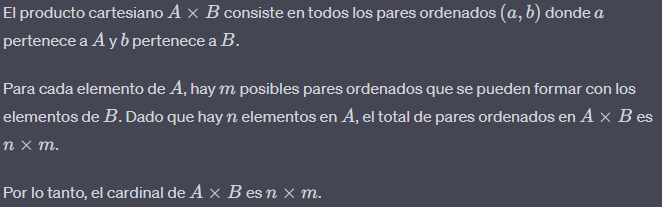

---
### Ejercicio 9

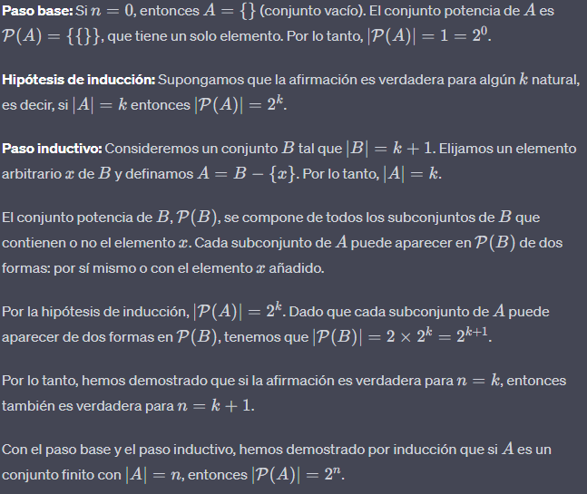

---
### Ejercicio 10

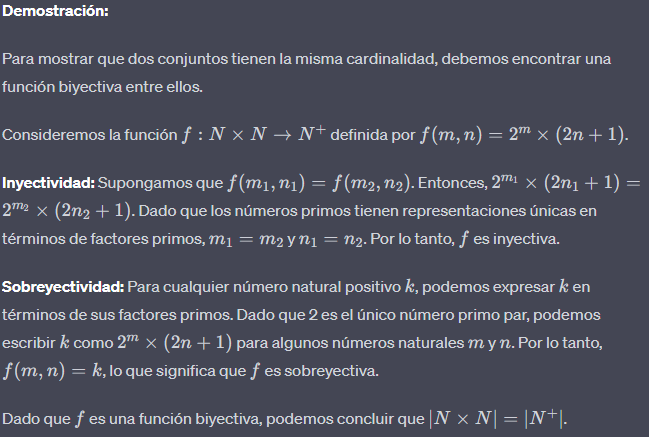

---
### Ejercicio 11

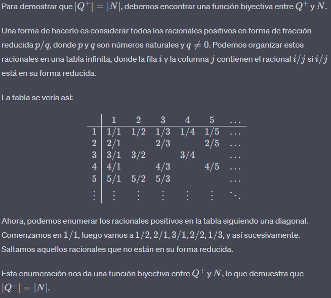

---
### Ejercicio 12

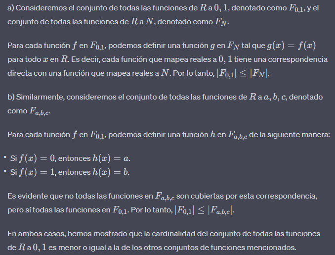

---

### Ejercicio 13

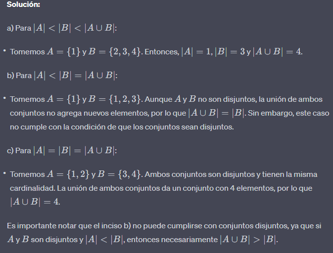

---
### Ejercicio 14

Para demostrar que dos conjuntos tienen la misma cardinalidad, debemos encontrar una biyección entre ellos. Una biyección es una función que es inyectiva y sobreyectiva

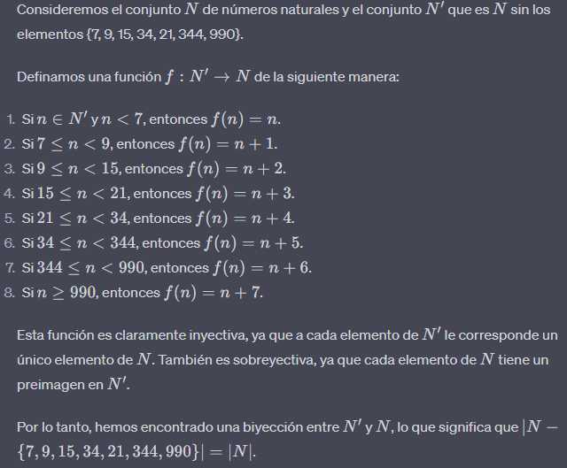

---
### Ejercicio 15

Para determinar si el conjunto de todas las frases en el idioma español es contable o incontable, consideremos lo siguiente:

1. El alfabeto español consta de un número finito de letras.
2. Una frase en español es una secuencia finita de palabras, y cada palabra es una secuencia finita de letras del alfabeto español.
3. Por lo tanto, el conjunto de todas las posibles palabras en español es contable, ya que podemos enumerarlas comenzando con palabras de una letra, luego palabras de dos letras, y así sucesivamente.
4. Sin embargo, el conjunto de todas las frases en español es el conjunto de todas las secuencias posibles de palabras en español. Dado que no hay límite en la longitud de una frase, este conjunto es equivalente al conjunto de todas las secuencias de números naturales, que es incontable.

Por lo tanto, el conjunto de todas las frases en el idioma español es **incontable**.

---
### Ejercicio 16

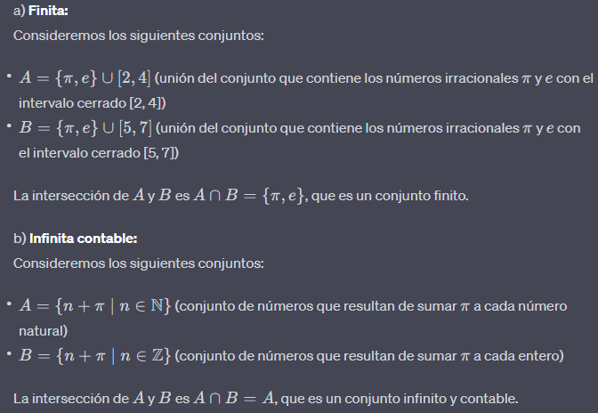
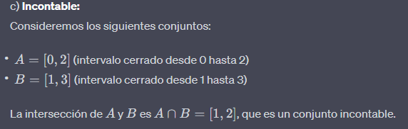

---
### Ejercicio 17

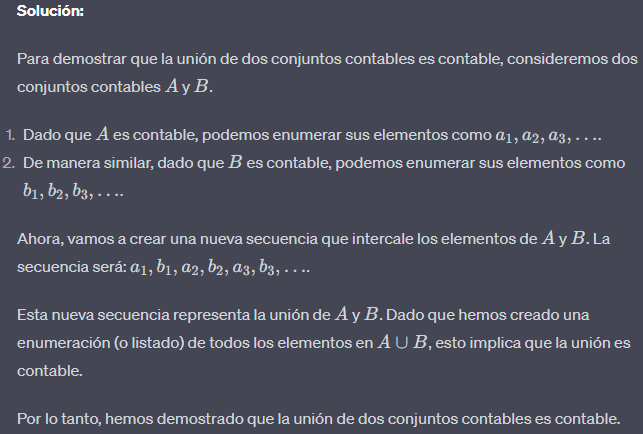

---
### Ejercicio 18

---

### Ejercicio 19

---

El ejercicio 16 de la práctica es el siguiente:

